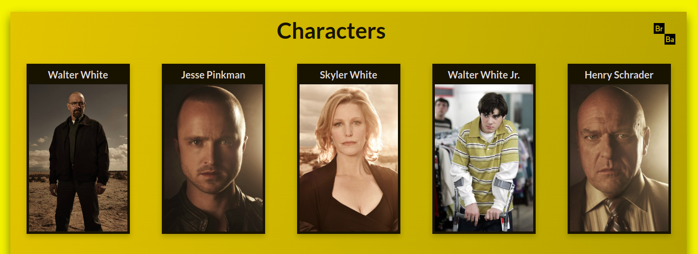
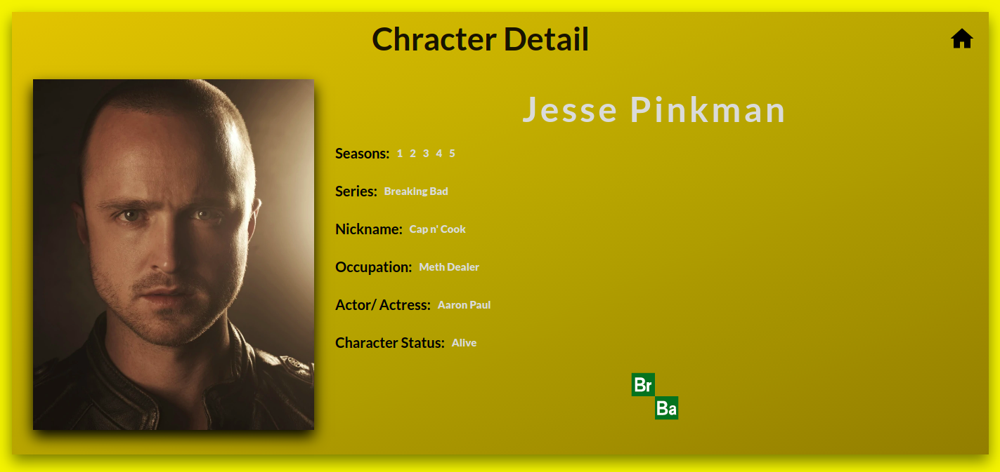

# Breaking Bad Characters

Breaking Bad Characters is a website that shows Breaking Bad serie characters, showing character's details and possibilitying to favorite if you want.

## Installation

Use the package manager [npm](https://docs.npmjs.com/) to install foobar.

```bash
npm install
```

## Usage

### Main Page

At the main page you can click on card to show character detail or you can click on Breaking Bad icon to show your favorite's characters.


<br>

### Character Detail Page

At the character detail page you can see some details about the character.
You can also click on two icons here:
<br>
1 - First icon beside page title you can click on home icon to return to main page.
<br>
2 - Second icon is the Breaking Bad icon at bottom of the page, it turns green when character is favorited.


<br>

## Updates

Some updates to be implemented:
<br>
1 - Filter by character name at the Main Page.
<br>
2 - CRUD implementation to Create, Update or Delete characters from page.

## Contributing

Pull requests are welcome. For major changes, please open an issue first to discuss what you would like to change.
